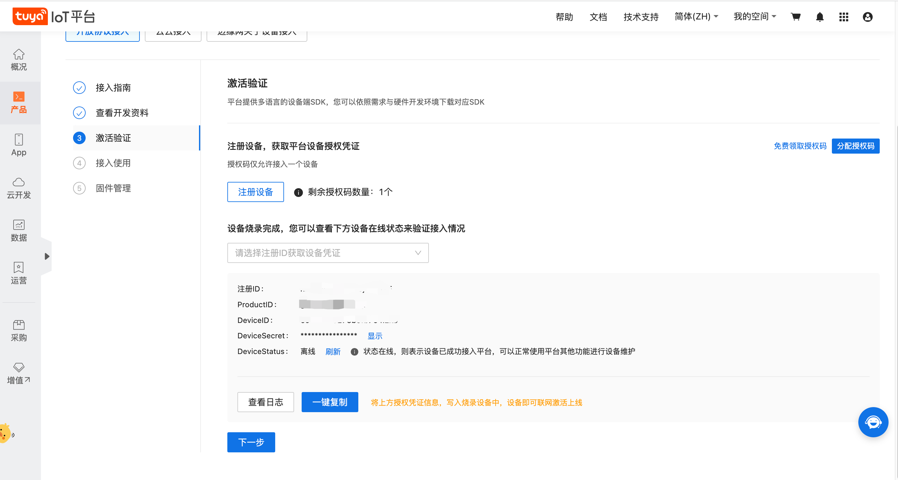
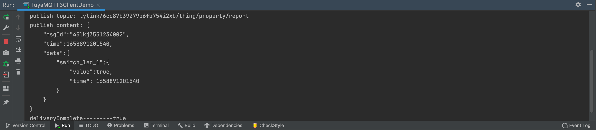
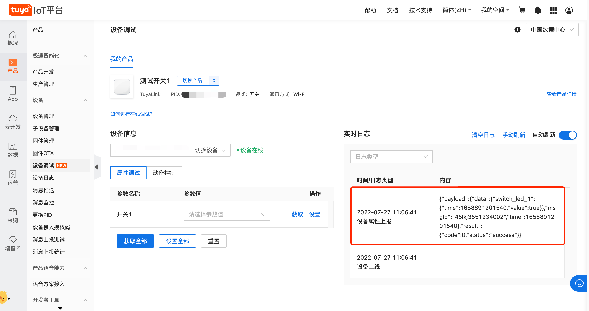

# TuyaLink MQTT Protocol Java Demo

TuyaLink demo is an example code of the Java version of the TuyaLink mqtt standard protocol, which is used to simulate the device connecting to the Tuya cloud through the TuyaLink protocol, and supports the reporting and distribution of the properties, actions, and events of the Tuya thing model.


TuyaLink mqtt standard protocol provides many built-in access protocol specifications out of the box, covering the business scenarios that most developers need to use, such as device model, submission and distribution, topology relationship, Ota, timing, remote configuration and distribution, file transfer, NTP, etc.

For more details, please visit the [official documents](https://developer.tuya.com/en/docs/iot/device-connection?id=Kb46bqq71kwtd)

## Procedure

### Step 1: Download the project
The following describes the structure of the SDK directory:
+ Core example code: tuyamqtt3clientdemo
+ Sign package: store TuyaLink mqtt connection related signature logic
+ Listener package: store mqtt messages listener
+ Resources: store certificates

### Step 2: Import project to IDEA
The downloaded sample code can be decompressed and imported into IntelliJ IDEA

### Step 3: Change device configuration
You need to get the ProductID, DeviceID and DeviceSecret information you got on the Tuya IOT platform before,You must change it.
```java
 // TuyaLink device configuration is as follows, you must change it
 String productId = "dsadusiau";
 String deviceId = "6cc87b393436fb754i2xb";
 String deviceSecret = "ffad8e34m1ae8c717";
```
Tips: the above identification example values are only for example, please do not use them directly.


### Step 4: Run it
At this point, the preparations are completed. Right click the TuyaMQTT3ClientDemo file and click Run to run the code.

You can see that the console attribute has been reported successfully.


At this point, switch to the device debugging page of the IOT platform, and you can see the data log reported by the device.
