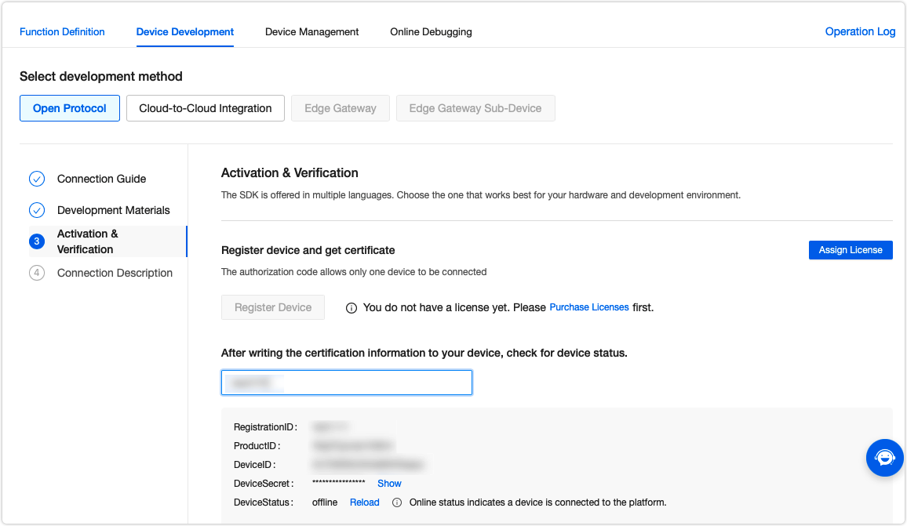
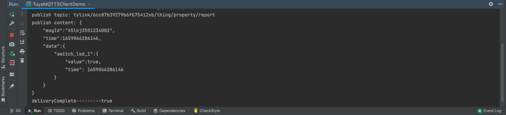
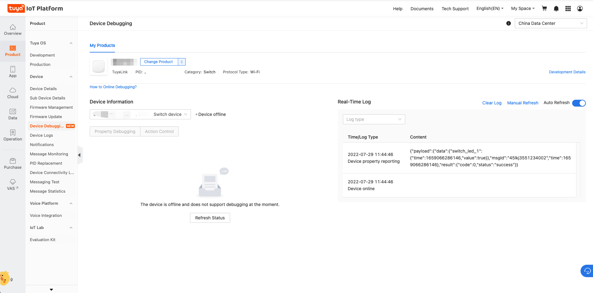

# TuyaLink MQTT Protocol Demo For Java

This demo shows how to connect a device to the [Tuya IoT Development Platform](https://iot.tuya.com/) through the TuyaLink MQTT protocol for Java. It supports bidirectional communication of data defined by Tuya's things data model in terms of property, action, and event.

TuyaLink MQTT protocol provides various turnkey protocol specifications to help you quickly implement the required features, including device models, sending and receiving data to and from cloud, topology, OTA update, timer, remote configuration, file transfer, and Network Time Protocol (NTP).

For more information, see [TuyaLink documentation](https://developer.tuya.com/en/docs/iot/device-connection?id=Kb46bqq71kwtd).

## Procedure

### Step 1: Download the project

The structure of the SDK directory:

+ Sample code: `TuyaMQTT3ClientDemo`
+ Sign package: Includes the signature logic for MQTT connection.
+ Listener: Includes the MQTT listener.
+ Resources: Includes the certificate.

### Step 2: Import project to IntelliJ IDEA

Unzip the downloaded file and import it to IntelliJ IDEA. Alternatively, you can directly clone the GitHub project to IntelliJ IDEA.

### Step 3: Change device configuration

Go to the [Tuya IoT Development Platform](https://iot.tuya.com/) and get the `ProductID`, `DeviceID`, and `DeviceSecret` information.  Make sure to replace the values of these three parameters with your own, and do not modify other code.

```java
 // TuyaLink device configuration is as follows, you must change it
 String productId = "dsadusiau";
 String deviceId = "6cc87b393436fb754i2xb";
 String deviceSecret = "ffad8e34m1ae8c717";
```
The values in the above code snippet are for demonstration only. Replace them with your own.



### Step 4: Run code

Right-click the `TuyaMQTT3ClientDemo` file and choose **Run** to run the code.

The output window shows successful data reporting to the cloud.



Navigate to **Device Debugging** on the Tuya IoT Development Platform and check the data reported from the device.


